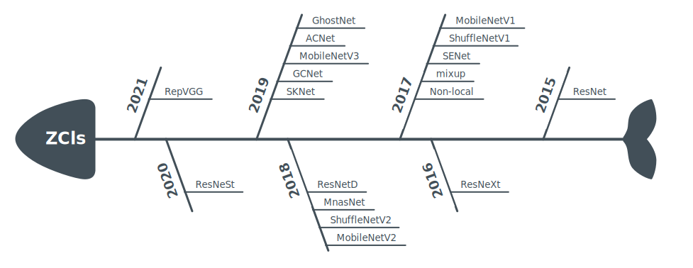

<div align="right">
  Language:
    🇺🇸
  <a title="Chinese" href="./README.zh-CN.md">🇨🇳</a>
</div>

 <div align="center"><a title="" href="https://github.com/ZJCV/ZCls"></a></div>

<p align="center">
  «ZCls» is a classification model training/inferring framework 
<br>
<br>
  <a href="https://github.com/RichardLitt/standard-readme"></a>
  <a href="https://conventionalcommits.org"></a>
  <a href="http://commitizen.github.io/cz-cli/"></a>
  <a href="https://pypi.org/project/zcls/"></a>
  <a href='https://zcls.readthedocs.io/en/latest/?badge=latest'>
    
  </a>
</p>

Supported Recognizers:

<p align="center">

</p>

*Refer to [roadmap](https://zcls.readthedocs.io/en/latest/roadmap/) for details*

## Table of Contents

- [Table of Contents](#table-of-contents)
- [Background](#background)
- [Installation](#installation)
- [Usage](#usage)
- [Maintainers](#maintainers)
- [Thanks](#thanks)
- [Contributing](#contributing)
- [License](#license)

## Background

In the fields of object detection/object segmentation/action recognition, there have been many training frameworks with high integration and perfect process, such as [facebookresearch/detectron2](https://github.com/facebookresearch/detectron2), [open-mmlab/mmaction2](https://github.com/open-mmlab/mmaction2) ...

Object classification is the most developed and theoretically basic field in deeplearning. Referring to the existing training framework, a training/inferring framework based on object classification model is implemented. I hope ZCls can bring you a better realization.

## Installation

See [INSTALL](https://zcls.readthedocs.io/en/latest/install/)

## Usage

How to train, see [Get Started with ZCls](https://zcls.readthedocs.io/en/latest/get-started/)

Use builtin datasets, see [Use Builtin Datasets](https://zcls.readthedocs.io/en/latest/builtin-datasets/)

Use custom datasets, see [Use Custom Datasets](https://zcls.readthedocs.io/en/latest/)

Use pretrained model, see [Use Pretrained Model](https://zcls.readthedocs.io/en/latest/pretrained-model/)

## Maintainers

* zhujian - *Initial work* - [zjykzj](https://github.com/zjykzj)

## Thanks

```
@misc{ding2021diverse,
      title={Diverse Branch Block: Building a Convolution as an Inception-like Unit}, 
      author={Xiaohan Ding and Xiangyu Zhang and Jungong Han and Guiguang Ding},
      year={2021},
      eprint={2103.13425},
      archivePrefix={arXiv},
      primaryClass={cs.CV}
}

@misc{ding2021repvgg,
      title={RepVGG: Making VGG-style ConvNets Great Again}, 
      author={Xiaohan Ding and Xiangyu Zhang and Ningning Ma and Jungong Han and Guiguang Ding and Jian Sun},
      year={2021},
      eprint={2101.03697},
      archivePrefix={arXiv},
      primaryClass={cs.CV}
}

@misc{fan2020pyslowfast,
  author =       {Haoqi Fan and Yanghao Li and Bo Xiong and Wan-Yen Lo and
                  Christoph Feichtenhofer},
  title =        {PySlowFast},
  howpublished = {\url{https://github.com/facebookresearch/slowfast}},
  year =         {2020}
}

@misc{zhang2020resnest,
      title={ResNeSt: Split-Attention Networks}, 
      author={Hang Zhang and Chongruo Wu and Zhongyue Zhang and Yi Zhu and Haibin Lin and Zhi Zhang and Yue Sun and Tong He and Jonas Mueller and R. Manmatha and Mu Li and Alexander Smola},
      year={2020},
      eprint={2004.08955},
      archivePrefix={arXiv},
      primaryClass={cs.CV}
}

@misc{han2020ghostnet,
      title={GhostNet: More Features from Cheap Operations}, 
      author={Kai Han and Yunhe Wang and Qi Tian and Jianyuan Guo and Chunjing Xu and Chang Xu},
      year={2020},
      eprint={1911.11907},
      archivePrefix={arXiv},
      primaryClass={cs.CV}
}
```

*For more thanks, check [THANKS](./THANKS)*

## Contributing

Anyone's participation is welcome! Open an [issue](https://github.com/ZJCV/ZCls/issues) or submit PRs.

Small note:

* Git submission specifications should be complied
  with [Conventional Commits](https://www.conventionalcommits.org/en/v1.0.0-beta.4/)
* If versioned, please conform to the [Semantic Versioning 2.0.0](https://semver.org) specification
* If editing the README, please conform to the [standard-readme](https://github.com/RichardLitt/standard-readme)
  specification.

## License

[Apache License 2.0](LICENSE) © 2020 zjykzj