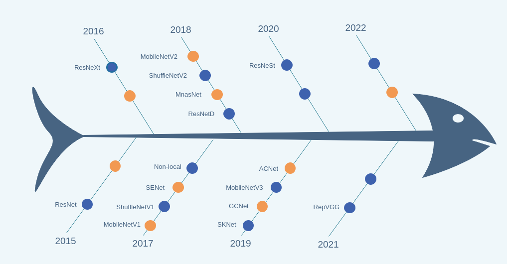

<div align="right">
  Language:
    🇺🇸
  <a title="Chinese" href="./README.zh-CN.md">🇨🇳</a>
</div>

 <div align="center"><a title="" href="git@github.com:ZJCV/ZCls.git"></a></div>

<p align="center">
  «ZCls» is a classification model benchmark code base
<br>
<br>
  <a href="https://github.com/RichardLitt/standard-readme"></a>
  <a href="https://conventionalcommits.org"></a>
  <a href="http://commitizen.github.io/cz-cli/"></a>
  <a href="https://pypi.org/project/zcls/"></a>
</p>

Supported Recognizers:



*Refer to [roadmap](./docs/roadmap.md) for details*

## Table of Contents

- [Table of Contents](#table-of-contents)
- [Background](#background)
- [Usage](#usage)
  - [Installation](#installation)
  - [How to use](#how-to-use)
- [Maintainers](#maintainers)
- [Thanks](#thanks)
- [Contributing](#contributing)
- [License](#license)

## Background

In order to further improve the algorithm performance, it is usually necessary to improve the existing model, which
inevitably involves code refactoring. Creating this repo, on the one hand, serves as the CodeBase of the new
model/optimization method, on the other hand, it also records the comparison between the custom model and the existing
implementation (such as Torchvision Models)

## Usage

### Installation

```
$ pip install zcls
```

### How to use

refer to [ZJCV/RotNet](https://github.com/ZJCV/RotNet)

## Maintainers

* zhujian - *Initial work* - [zjykzj](https://github.com/zjykzj)

## Thanks

```
@misc{ding2021repvgg,
      title={RepVGG: Making VGG-style ConvNets Great Again}, 
      author={Xiaohan Ding and Xiangyu Zhang and Ningning Ma and Jungong Han and Guiguang Ding and Jian Sun},
      year={2021},
      eprint={2101.03697},
      archivePrefix={arXiv},
      primaryClass={cs.CV}
}

@misc{fan2020pyslowfast,
  author =       {Haoqi Fan and Yanghao Li and Bo Xiong and Wan-Yen Lo and
                  Christoph Feichtenhofer},
  title =        {PySlowFast},
  howpublished = {\url{https://github.com/facebookresearch/slowfast}},
  year =         {2020}
}

@misc{zhang2020resnest,
      title={ResNeSt: Split-Attention Networks}, 
      author={Hang Zhang and Chongruo Wu and Zhongyue Zhang and Yi Zhu and Haibin Lin and Zhi Zhang and Yue Sun and Tong He and Jonas Mueller and R. Manmatha and Mu Li and Alexander Smola},
      year={2020},
      eprint={2004.08955},
      archivePrefix={arXiv},
      primaryClass={cs.CV}
}

@misc{ding2019acnet,
      title={ACNet: Strengthening the Kernel Skeletons for Powerful CNN via Asymmetric Convolution Blocks}, 
      author={Xiaohan Ding and Yuchen Guo and Guiguang Ding and Jungong Han},
      year={2019},
      eprint={1908.03930},
      archivePrefix={arXiv},
      primaryClass={cs.CV}
}

@misc{howard2019searching,
      title={Searching for MobileNetV3}, 
      author={Andrew Howard and Mark Sandler and Grace Chu and Liang-Chieh Chen and Bo Chen and Mingxing Tan and Weijun Wang and Yukun Zhu and Ruoming Pang and Vijay Vasudevan and Quoc V. Le and Hartwig Adam},
      year={2019},
      eprint={1905.02244},
      archivePrefix={arXiv},
      primaryClass={cs.CV}
}

@misc{cao2019gcnet,
      title={GCNet: Non-local Networks Meet Squeeze-Excitation Networks and Beyond}, 
      author={Yue Cao and Jiarui Xu and Stephen Lin and Fangyun Wei and Han Hu},
      year={2019},
      eprint={1904.11492},
      archivePrefix={arXiv},
      primaryClass={cs.CV}
}
```

For more thanks, check [THANKS](./THANKS)

## Contributing

Anyone's participation is welcome! Open an [issue](https://github.com/ZJCV/ZCls/issues) or submit PRs.

Small note:

* Git submission specifications should be complied
  with [Conventional Commits](https://www.conventionalcommits.org/en/v1.0.0-beta.4/)
* If versioned, please conform to the [Semantic Versioning 2.0.0](https://semver.org) specification
* If editing the README, please conform to the [standard-readme](https://github.com/RichardLitt/standard-readme)
  specification.

## License

[Apache License 2.0](LICENSE) © 2020 zjykzj