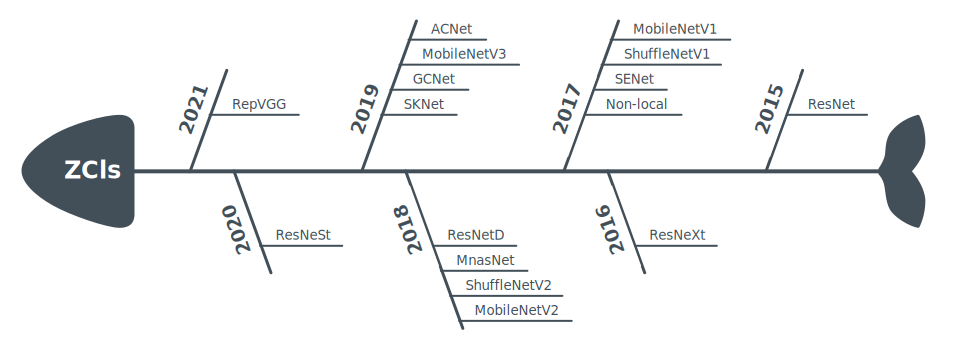

# RoadMap

## Supported Recognizers

* [[2021]DiverseBranchBlock](https://arxiv.org/abs/2103.13425)
* [[2021]RepVGG](https://arxiv.org/abs/2101.03697)
* [[2020]ResNeSt](https://arxiv.org/abs/2004.08955)
* [[2019]GhostNet](https://arxiv.org/abs/1911.11907)
* [[2019]ACNet](https://arxiv.org/abs/1908.03930)
* [[2019]CutMix](https://arxiv.org/abs/1905.04899)
* [[2019]MobileNetV3](https://arxiv.org/abs/1905.02244)
* [[2019]GCNet](https://arxiv.org/abs/1904.11492)
* [[2019]SKNet](https://arxiv.org/abs/1903.06586)
* [[2018]ResNetD](https://arxiv.org/abs/1812.01187)
* [[2018]MNasNet](https://arxiv.org/abs/1807.11626)
* [[2018]ShuffleNetV2](https://arxiv.org/abs/1807.11164)
* [[2018]MobileNetV2](https://arxiv.org/abs/1801.04381)
* [[2017]Non-local](https://arxiv.org/abs/1711.07971)
* [[2017]Mixup](https://arxiv.org/abs/1710.09412)
* [[2017]SENet](https://arxiv.org/abs/1709.01507)
* [[2017]ShuffleNetV1](https://arxiv.org/abs/1707.01083)
* [[2017]MobileNetV1](https://arxiv.org/abs/1704.04861)
* [[2016]ResNeXt](https://arxiv.org/abs/1611.05431)
* [[2015]ResNet](https://arxiv.org/abs/1512.03385)